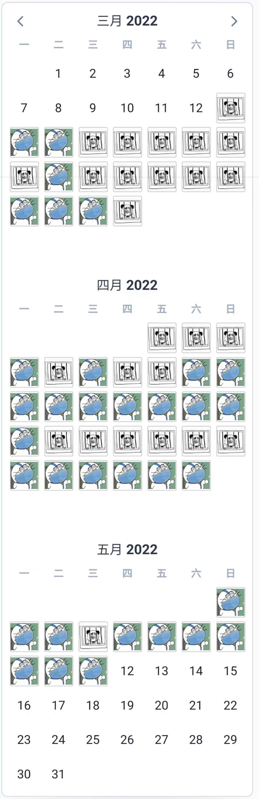

# 隔离日历

生成隔离期间做核酸的表情包日历
[在线体验](https://quarantine-calendar.vercel.app/)

生成的图片如下:




## 使用方法

使用 yarn 作为包管理工具，运行以下命令进行本地开发：
```shell
yarn
yarn dev
```
## 所用插件
日历插件使用的是：[v-calendar](https://github.com/nathanreyes/v-calendar)

生成图片插件是：[html2canvas](https://html2canvas.hertzen.com/)

## TODO
- [ ] LocalStorage 存储

## BUG

- [ ] 微信打开无法保存图片
- [ ] 保存图片的清晰度过低
- [ ] IOS 端生成图片中 checkbox 的样式不对
- [ ] 使用体验较差。。。


> 随便开发的一个玩意，所以代码写得也很烂，我也搞不懂我为啥要起一个 “AnyScript” 的项目。😂
>
> 不过也没什么太大的用处，应该也不会怎么完善了。
>
> 欢迎有兴趣的大佬提 PR 继续完善。
